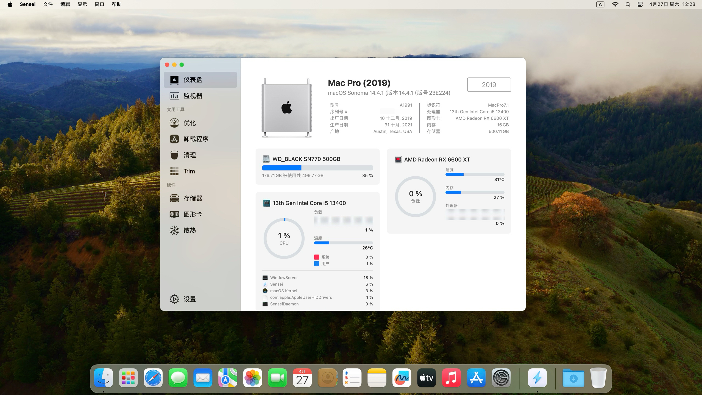

# MSI-B760M-BOMBER-WIFI-Hackintosh-Sonoma

Hackintosh EFI files for MSI B760M BOMBER WIFI Motherboard

| Hardware         | Specs                                 |
| ---------------- | ------------------------------------- |
| Motherboard      | MSI B760M BOMBER WIFI                 |
| CPU              | Intel i5-13400                        |
| Graphics         | Sapphire NITRO+ AMD Radeon RX 6600 XT |
| RAM              | Adata 16GB DDR5                       |
| Hard Drive       | WD_BLACK SN770 500G                   |
| WIFI / Bluetooth | Broadcom BCM94360CS                   |

## Working

- ✅ Graphics
- ✅ Audio
- ✅ WiFi (2.4G & 5G) / Ethernet
- ✅ Bluetooth
- ✅ USB 2.0 & 3.0
- ✅ AirDrop / Handoff / Continuity / Universal Control
- ✅ Sleep / Wake

## Not Working

- ❌ Sidecar

## Notice

After installation, you need to use [OCLP](https://github.com/dortania/OpenCore-Legacy-Patcher) to fix the wifi and bluetooth issue.
